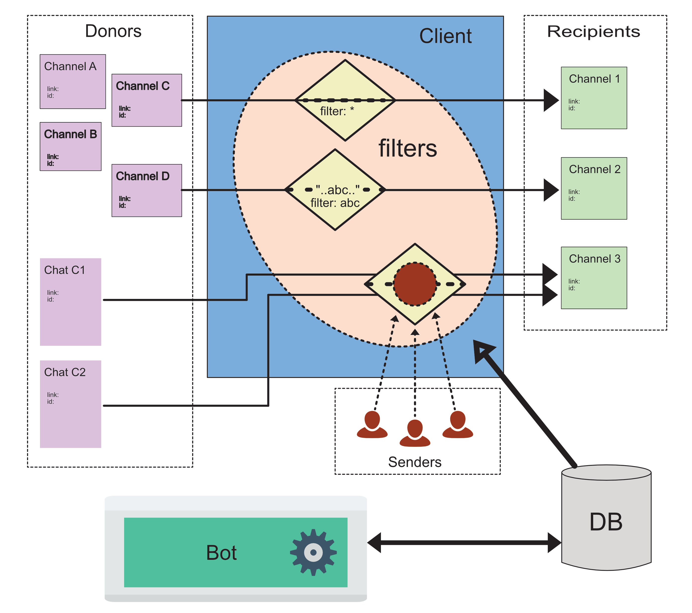

Telegram Post Client
=====

The idea to write a specialized client for the popular Telegram messenger 
came to me after a conversation with a friend of mine who runs several channels 
in this popular messenger and is forced to spend most of his time searching for 
interesting information in various Telegram channels.

How it works
=====
The following figure shows an approximate block diagram and operating logic. Ideally, 
the service is divided into two parts: the client itself and the bot.


The bot is designed to manage users, and also allows registered users of the system 
to create and change rules (filters). All information about users and the filters they create 
is stored in the SQLite database.

After changing the rules, the bot sends a message to the client in a private channel specially 
created for this purpose, the client accesses the database and receives an updated list of 
rules from it and caches them in its global array. After this, the client checks all incoming 
messages for compliance with the specified rules and, if they match, sends filtered messages 
to the channels specified in the rules. This system allows you to serve several independent clients.
The source code for this service is located in my other repository and is available by private request.


This repository contains a simplified version of the message forwarding service, consisting only 
of a telegram client and a database. The client is managed by sending messages to a special private 
telegram channel, and the rules are set by sending a CSV file to the same channel.

Install
=======

```
python3 -m venv venv
source venv/bin/activate
pip install -r requirements.txt
```
In the 'private' directory, rename the file 'tokens.copy.py' to the file 'tokens.py', 
open it in a text editor and fill it out following the instructions. 

Launch the client and check its functionality.
```
python3 postclient.py
```
...\
debug and fix errors. Stop the client, using control+C
Add a service so that the bot starts when the server starts and restarts if it crashes

In the systemd folder rename the file postclient.copy.service to postclient.service and 
fill in the paths to the script

Enable service:
```
systemctl daemon-reload 
systemctl enable /path to /post_client/systemd/postclient.service 
```

Fix possible errors and start the service:
```
systemctl start postclient.service
```

To check the service status use the command:
```
systemctl status postclient.service
```

To force stop the service, use the command:
```
systemctl stop postclient.service
```

Credits
=======
I express my deep gratitude to the creator of the `Telegram Client API library (telethon)`, which allowed me 
to implement the functionality of this service -  [LonamiWebs - Telethon](https://github.com/LonamiWebs/Telethon)

I express my deep gratitude to the creator of the `younotyou` library, which allowed me to implement the 
functionality of a smart filter [matt-manes/younotyou](https://github.com/matt-manes/younotyou)
